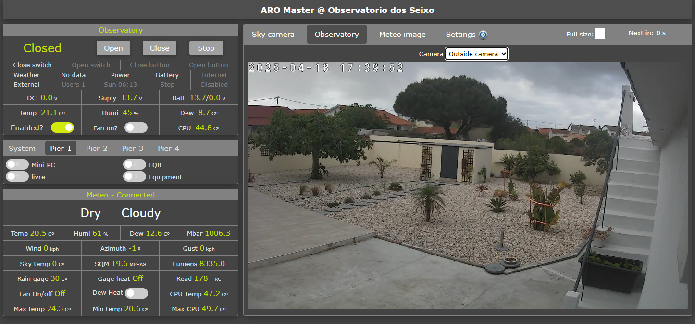

> [!IMPORTANT]
> 10-08-2025 V2.0 firmare/software
> Redesigned web server interface
> We now use Bootstrap v5.3 frontend
> Added webcam support for local observatory camera 
> Added ASI camera for local observatory camera
> ...more information about V2 coming soon

# Firmware version: V1.8
> [!TIP]
> 18-06-2025 new V1.8 firmare/software
>- Adds the observatory "Ventilation" feature, requires V4 boards since an extra input is needed for the vent position sensor.
>- Rpi fan control added.
>- Serial communication with a dedicated weather station (requires V4 boards).
>- New ALPACA Switch implementation that combines the 'Pier relays' and the 'System relays'.
>- New "log" console frame in the Webpage shows activity information and messages.
>- New content layout in some Webpage frames
>- The system will now only control 4 pier per location, and only 4 relays per pier. (contact me if this is not enough)


The **Aro-Master** software/firmware runs as a '_daemon_' (a computer program that runs as a background process) on the Raspberry Pi and exposes its UI (user interface) through the embedded web-server.

Once connected to your LAN (your home or local network) one can access the ARO-Master web-server using a web browser that supports HTML 5.

I won't go into details on how to set up the Raspberry Pi (take a look here: https://www.raspberrypi.com/software/), the requirements are basically a ***Raspberry Pi 4*** with at least ***2GB RAM*** and Raspberry Pi OS installed, it's assumed that you have an basic understanding of how to access and use Linux on a Raspberry Pi, including how to use the command line to edit some text.

- Download the zip file with the latest firmware
- Extract the contents off that file to `/home` folder on the Rpi
- There will be created a folder with the name `/home/aro-master`
- Edit the `rc.local` file located in `/etc`
```
sudo nano /etc/rc.local
```
- Add a new line at the bottom immediately before `exit 0` and past the following line of text:
```
sudo /home/aro-daemon/aro-d
```
- The final version of the file `/etc/rc.local` should look like this:
```Bash
#!/bin/sh -e
#
# rc.local
#
# This script is executed at the end of each multiuser runlevel.
# Make sure that the script will "exit 0" on success or any other
# value on error.
#
# In order to enable or disable this script just change the execution
# bits.
#
# By default this script does nothing.

# Print the IP address
_IP=$(hostname -I) || true
if [ "$_IP" ]; then
  printf "My IP address is %s\n" "$_IP"
fi

sudo /home/paulo/ARO-Daemon/aro-d
exit 0
```
- Reboot the Raspberry Pi `sudo reboot now`

After that you should be able to access the Webpage using the URL **http://aro.local** or **http://aro.home**

> [!NOTE]
> The _Assembled version_ of the ARO-Master Box comes with all hardware and software already installed

## The Webpage consists of
- System data info
- Weather data info
- Setup and configuration
- Image from the sky camera (if available)
- Meteo satellite image

The interface is supposed to be self-explanatory ... but sometimes there is a great distance between the 'supposed' and the reality, please let me know if you have any questions using  [GitHub Discussions](https://github.com/almtree/aro-master/discussions).





